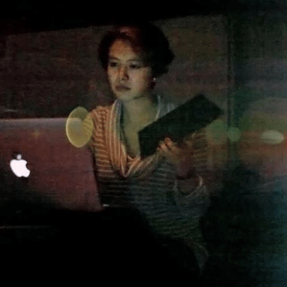

#### for more information about the hosts Zhenzhen Qi & Yang Wang, [Go back to zzyw homepage](/)

----

    

    <h1>2017 Summer New Media Art Workshop Proposal [draft]</h1>
    <h2>Series 01: Interactive Arts & Generative Arts</h2>
    <h1>2017 夏季 新媒体艺术工作坊 策划书 [草稿]</h1>
    <h2>系列之一： 交互艺术 & 生成艺术</h2>
    

-----

## 什么是新媒体艺术

New media art refers to artworks created with new media technologies, including digital art, computer graphics, computer animation, virtual art, Internet art, interactive art, video games, computer robotics, 3D printing, cyborg art and art as biotechnology

-- Wikipedia "New Media Art"

新媒体艺术是指用新媒体技术创造的艺术，包括数码艺术，计算机图像，计算机动画，视觉艺术，网络艺术，交互艺术，电子游戏，电脑机器人，3D打印，赛博格艺术，和作为生物技术的艺术。

## 什么是交互艺术

Interactive art is a genre of art in which the viewers participate in some way by providing an input in order to determine the outcome. Unlike traditional art forms wherein the interaction of the spectator is merely a mental event, interactivity allows for various types of navigation, assembly, and/or contribution to an artwork, which goes far beyond purely psychological activity.[3] Interactivity as a medium produces meaning.

-- Wikipedia "Interactive Arts"

交互艺术是艺术的一种，观者以某种形式参与来决定艺术最终的形态。不像传统艺术形式那样 --『交互』仅仅是精神性得观察，交互艺术的交互性允许各种形式的探索，重组，和/或 对于艺术的种种贡献。这样的交互性远远比精神性得活动要深入到多。交互性本身作为一种媒介，产生了意义。

## 生成艺术

与交互艺术非常相似，都是由编程语言创作，不同的是生成艺术更多地依赖于算法的，而不是用户的输入。生成艺术通常是抽象的，视觉的。生成艺术可以添加交互性，便成为交互艺术。

----------

## 我们为什么要做交互艺术工作坊

在1960年，纽约现代艺术馆请瑞士装置艺术家Jean Tingguely在艺术馆的雕塑园里做一个作品。Tingley 花了三个月时间收集废弃的机器零件搭建出一个自动化的机械装置。按钮一下，机械装置精准的运作，并在27分钟之后按照预定设想自燃后化为废墟。今天，废墟的残骸受到各国新媒体艺术家们的膜拜，被封为新媒体及后现代艺术的鼻祖。19世纪60年代的西方艺术界为什么突然对自动机械产生如此浓厚的兴趣？Tinguely的一把火烧掉了什么？点燃了什么？机械和人类，艺术和科技之间的关系发生了什么样的改变？通过这个新媒体工作坊，我们会通过讲评艺术家作品，并带领大家创作自己的艺术作品而对当代新媒体艺术进行讨论及亲身感受。

-----

## Schedule Outline

-----

工作坊将持续两天，周六 & 周日 两天

### Part 1: Workshops 讲座 & 工作坊

**讲座：What is New Media Arts? 什么是新媒体艺术**

- 什么是新媒体艺术？

- 新媒体艺术与传统艺术有何不同？

- 新媒体带来的创作可能性

- 有趣的新媒体作品

**Workshop: Generative Arts 工作坊：生成艺术**

- Basics of 编程基本

- Pixel manipulation 像素控制

- Particle system 粒子系统

- L-System L系统

- Vector field 向量场

- Flocking

- Web crawler 网络爬虫

- Video scribe 划视频

**Workshop: Physical Computing: Arduino**

* INPUT:

    * Pulse Sensor 心跳感应器

    * Temperature Sensor 温度感应器

    * Photoelectric sensor 光线感应器

    * Infrared sensor 距离感应器

* OUTPUT:

    * Speaker 声音输出

    * Motor 马达（物理运动）

**Workshop: Programming Interactivity 工作坊：编写交互性**

* MS Kinect

    * Skeleton Tracking 人体骨骼检测

    * Depth Sensing 深度图像检测

* Camera & OpenCV 摄像头OpenCV

    * Facial Recognition 脸部识别

    * Movement Detection 移动检测

    * EEG Sensor 脑波检测

### Part 2: Project Development 项目开发

有意参与展览的工作坊参与者，向大家展示自己的项目想法。经过简短的讨论，每个人都可以选择与他人合作，或者独立完成。接下去就是项目的开发，我们会提供技术和想法支持，协调资源。

### Part 3: 展览

所有组/个人作品展览 -> After party.

-----

## About the Workshop Leader

## 关于工作坊主讲人

----

**Zhenzhen Qi 漆贞贞**

> New Media Artist & Educator

> 新媒体艺术人，新媒体艺术教育人

> MPS @ New York University, Tisch School of the Arts - ITP

> BS @ UC Berkeley - Mathematics

哥伦比亚大学艺术教育博士EdD在读
Columbia University, EdD. Doctorate Student

哥伦比亚大学新媒体兼职讲师
Columbia University, Adjunct Professor

> _New Media New Form_  _Digital Foundation_

纽约市立大学新媒体艺术讲师
Baruch College, The City University of New York, Adjunct Professor

>  _Digital Interactivity_

2017纽约创意科技周工作坊主持人
2017 Creative Tech Week Workshop Host

哥伦比亚大学创意科技课程制定员
Columbia University Creative technology Curriculum Fellow
